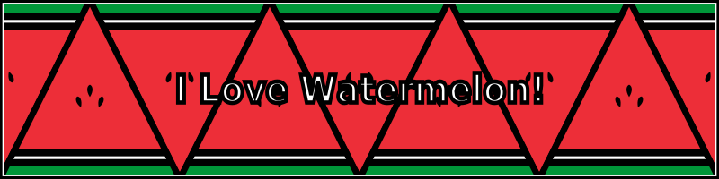

# ILoveWatermelon

## Watermelon banners

Reusable watermelon banners and related docs.

All banners and badges link to [StandWithPalestine](https://github.com/TheBSD/StandWithPalestine/blob/main/docs/README.md).

### Use the banner

- Add `banner-no-action.svg` to your README or profile.
- Add `banner-no-text.svg` if you want the art only.
- Use `banner-direct.svg` if you want the small action arrow.
- Use the badge if you want a compact version.
